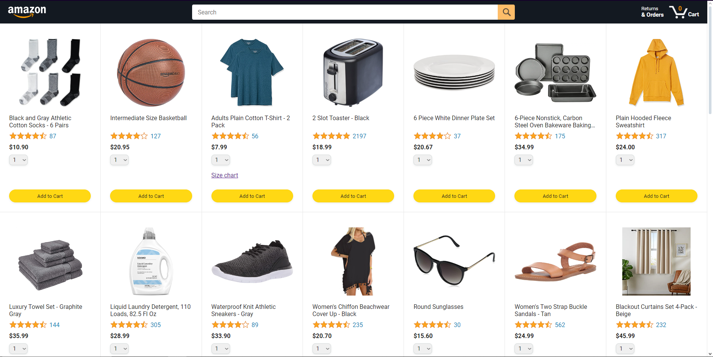
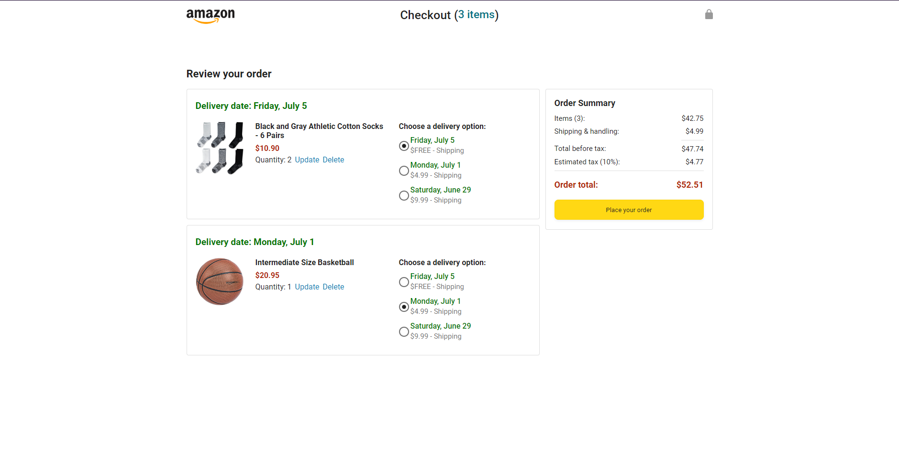

## JavaScript Amazon Clone

This project i've created is from youtube tutorial.

Amazon Clone project with backend using fetch api

this project has different concept of javascript
-fetch
-async,await
-promise
-try and catch
-url parameters
and many more..

i have learned a lot in javascript by making this project.

credit to SuperSimple.dev for the 22 hours youtube tutorial.
-video link: https://www.youtube.com/watch?v=EerdGm-ehJQ&t=76382s

# Page Overview

